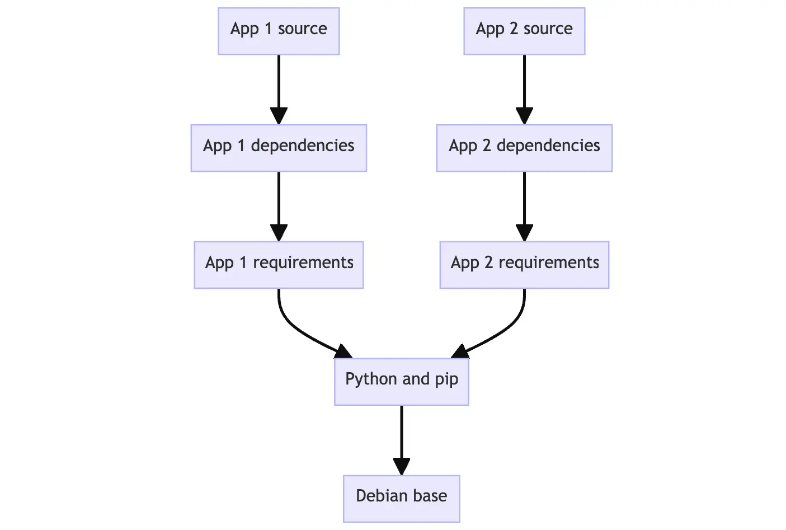
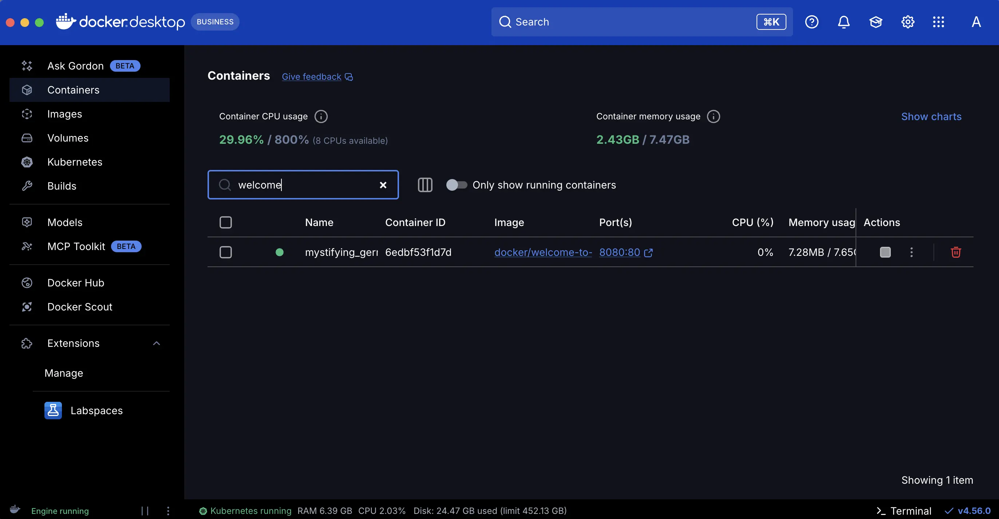
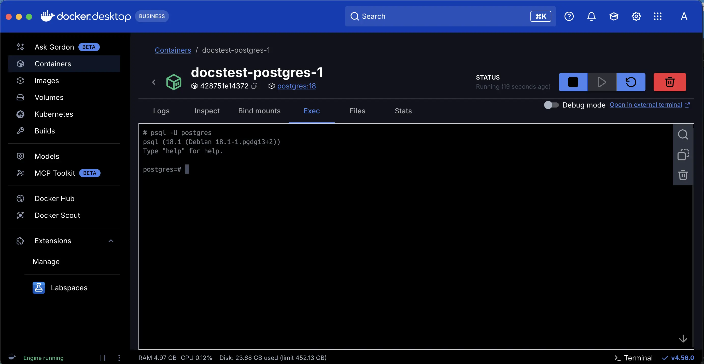

## Table of Contents

- [Install Docker Desktop](#get-docker---install-docker-desktop-on-windows-with-wsl2-backend)
- [Install Docker Engine on a vps hosting (ubuntu)](#install-docker-engine-on-a-vps-hosting-or-ubuntu-when-needed)
- [What is Docker](#what-is-docker)

- [Introduction](#introduction)
  - [Get Docker Desktop](#get-docker-desktop)
  - [Develop with containers](#develop-with-containers)
  - [Build and push your first image](#build-and-push-your-first-image)
    - [Method-1: CLI](#method-1-cli)
    - [Method-2: VSCode Extension](#method-2-vs-code-extension)

- [Docker Concepts](#docker-concepts)
  - [The Basics](#the-basics)
    - [What is a Container?](#what-is-a-container)
      - [Run Container using Docker Desktop](#method-1-to-run-a-container-docker-desktop-gui)
      - [Run Container using CLI](#method-2-to-run-a-container-cli)

    - [What is an Image?](#what-is-an-image)
      - [Using Docker Desktop](#method-1-to-search-and-pull-a-container-image-docker-desktop)
      - [Using CLI](#method-2-to-search-and-pull-a-container-image-cli)
    - [What is a registry?](#what-is-a-registry)

# Get Docker - Install Docker Desktop on Windows (with wsl2 backend)

[Link: Official Installation Guide](https://docs.docker.com/desktop/setup/install/windows-install/)

1. First check if required wsl version is installed on windows
   open cmd/powershell

```cmd
> wsl --version
> wsl --update
```

- You can also check your Linux distribution

```cmd
> wsl.exe --list --verbose
```

- If wsl insn't installed, install it
  [Link: wsl installation guide](https://learn.microsoft.com/en-us/windows/wsl/install)

Open cmd/powershell

```cmd
wsl --install
```

That'll all. Then check if a wsl version is installed

2. Download docker desktop installer for windows (from the installation page)
3. Double-click Docker Desktop Installer.exe to run the installer. The installer will ask which installation mode you prefer. Choosing 'per-user' (recommended) installs to %LOCALAPPDATA%\Programs\DockerDesktop and requires no administrator privileges. Choosing all users will prompt for elevation. Close after completed.
4. Start docker desktop (Search for docker desktop from windows and open). Sign in or Register.

# Install Docker Engine on a VPS hosting or Ubuntu (When needed)

While docker desktop is an GUI interface for docker, you will need to install docker engine (not docker desktop) on the vps hostings (Linux ubuntu)
[Link: Installation Guide](https://docs.docker.com/engine/install/ubuntu/)

## 1. Uninstall conflicting packages (but keep previous data)

- Run the following command to uninstall all conflicting packages:

```bash
sudo apt remove $(dpkg --get-selections docker.io docker-compose docker-compose-v2 docker-doc podman-docker containerd runc | cut -f1)
```

> [!NOTE]
> Images, containers, volumes, and networks stored in /var/lib/docker/ `are not` automatically removed (will be preserved) when you uninstall Docker (running the above command).

### Clean start (if you don't want to keep previous data)

- If you want to start with a clean installation, and prefer to clean up any existing data, follow these steps:

- `WARNING:` The following steps will remove all existing data related to docker
- Uninstall the Docker Engine, CLI, containerd, and Docker Compose packages:

```bash
sudo apt purge docker-ce docker-ce-cli containerd.io docker-buildx-plugin docker-compose-plugin docker-ce-rootless-extras
```

- Images, containers, volumes, or custom configuration files on your host aren't automatically removed. To delete all images, containers, and volumes:

```bash
sudo rm -rf /var/lib/docker
sudo rm -rf /var/lib/containerd
```

- Remove source list and keyrings

```bash
sudo rm /etc/apt/sources.list.d/docker.sources
sudo rm /etc/apt/keyrings/docker.asc
```

## 2. Install using `apt` repository

- [Link: Installation guide](https://docs.docker.com/engine/install/ubuntu/#install-using-the-repository)

1. Set up Docker's apt repository.

```bash
# Add Docker's official GPG key:
sudo apt update
sudo apt install ca-certificates curl
sudo install -m 0755 -d /etc/apt/keyrings
sudo curl -fsSL https://download.docker.com/linux/ubuntu/gpg -o /etc/apt/keyrings/docker.asc
sudo chmod a+r /etc/apt/keyrings/docker.asc

# Add the repository to Apt sources:
sudo tee /etc/apt/sources.list.d/docker.sources <<EOF
Types: deb
URIs: https://download.docker.com/linux/ubuntu
Suites: $(. /etc/os-release && echo "${UBUNTU_CODENAME:-$VERSION_CODENAME}")
Components: stable
Architectures: $(dpkg --print-architecture)
Signed-By: /etc/apt/keyrings/docker.asc
EOF

sudo apt update
```

2. Install the Docker packages (latest)

```bash
sudo apt install docker-ce docker-ce-cli containerd.io docker-buildx-plugin docker-compose-plugin
```

3. After installation, verify that Docker is running:

```bash
sudo systemctl status docker
```

- If Docker is not running, start it manually:

```bash
sudo systemctl start docker
```

4. Verify that the installation is successful by running the `hello-world` image:

```bash
sudo docker run hello-world
```

# What is Docker?

- In real world, a docker is a person who works at the dock/port and load/unload shipping containers.
- [Link: Refer Documentation](https://docs.docker.com/get-started/docker-overview/)
- Docker is an open platform for developing, shipping, and running applications.
- Docker enables you to separate your applications from your infrastructure.
- significantly reduce the delay between writing code and running it in production.

## The Docker platform

- Docker provides the ability to package and run an application in a loosely isolated environment called a `container`.
- Containers are lightweight and contain everything needed to run the application, so you don't need to rely on what's installed on the host.
- You can share the same container to others.
- When you're ready, deploy your application into your production environment, as a container.

## What can I use Docker for?

- Fast, consistent delivery of your applications.
  Containers are great for continuous integration and continuous delivery (CI/CD) workflows.
- Responsive deployment and scaling.
  Docker containers can run on a developer's local laptop, on physical or virtual machines in a data center, on cloud providers, or in a mixture of environments.

## Docker architecture

- Docker uses a client-server architecture.
- The Docker client talks to the Docker daemon (in server), which does the heavy lifting of building, running, and distributing your Docker containers.

### The Docker daemon

- The Docker daemon (`dockerd`) listens for Docker API requests and manages Docker objects such as images, containers, networks, and volumes.

### The Docker client

- The Docker client (`docker`) is the primary way that many Docker users interact with Docker.
- When you use commands such as `docker run`, the client sends these commands to `dockerd`, which carries them out.
- The `docker` command uses the Docker API.

### Docker Desktop

Docker Desktop is an easy-to-install application for your Mac, Windows, or Linux environment that enables you to build and share containerized applications and microservices. Docker Desktop includes the Docker daemon (dockerd), the Docker client (docker), Docker Compose, Docker Content Trust, Kubernetes, and Credential Helper. For more information see [Docker Desktop](https://docs.docker.com/desktop/)

### Docker registries

- A Docker registry stores Docker images.
- `Docker Hub` is a public registry that anyone can use, and Docker looks for images on Docker Hub by default.
- You can even run your own private registry.

### Docker Objects

#### Images

- An image is a read-only template with instructions for creating a Docker container.
- Often, an image is based on another image, with some additional customization.
- To build your own image, you create a `Dockerfile` with a simple syntax for defining the steps needed to create the image and run it.

#### Containers

- A container is a runnable instance of an image.
- You can create, start, stop, move, or delete a container using the Docker API or CLI.
- You can connect a container to one or more networks, attach storage to it, or even create a new image.
- By default, a container is relatively well isolated from other containers and its host machine.

#### Example `docker run` command

The following command runs an ubuntu container, attaches interactively to your local command-line session, and runs /bin/bash.

```bash
docker run -i -t ubuntu /bin/bash
```

1. If you don't have the ubuntu image locally, Docker pulls it from your configured registry, as though you had run `docker pull ubuntu` manually.
2. Docker creates a new container, as though you had run a `docker container create` command manually.
3. Docker allocates a read-write filesystem to the container, as its final layer.
4. Docker creates a network interface to connect the container to the default network.
5. Docker starts the container and executes `/bin/bash`.
6. When you run `exit` to terminate the /bin/bash command, the container stops but isn't removed.

## The underlying technology

- Docker is written in the `Go programming language`

# Introduction

What we'll learn in this series:

- Set up Docker Desktop
- Run your first container
- Build your first image
- Publish your image on Docker Hub

## Get Docker Desktop

Docker Desktop is the all-in-one package to build images, run containers, and so much more.

### Why Docker Desktop?

- Easily collaborate with team members
- Minimize setup and overhead to speed up the development process.

### Install Docker Desktop

- Follow [this link](#get-docker---install-docker-desktop-on-windows-with-wsl2-backend) for installation guide

### Run your first container

- First open/run the docker desktop
- open your CLI terminal and start a `container` by running `docker run` command:

```bash
docker run -d -p 8080:80 docker/welcome-to-docker
```

### Access the frontend

For this container, the frontend is accessible on port 8080. To open the website, visit http://localhost:8080 in your browser.

### Manage containers using Docker Desktop

Docker Desktop simplifies container management for developers by streamlining the setup, configuration, and compatibility of applications across different environments, thereby addressing the pain points of environment inconsistencies and deployment challenges.

1. Open Docker Desktop and select the `Containers` field on the left sidebar.
2. You can view information about your container including `logs`, and `files`, and even access the shell by selecting the `Exec` tab.
3. Select the `Inspect` field to obtain detailed information about the container.

## Develop with containers

### Start the project

1. To get started, clone the project to your local machine:

```bash
$ git clone https://github.com/docker/getting-started-todo-app
```

- navigate into the new directory:

```bash
$ cd getting-started-todo-app
```

2. Once you have the project, start the development environment using Docker Compose.

```bash
$ docker compose watch
```

3. You will see an output that shows container images being pulled down, containers starting, and more. Afer things are finished, open your browser to http://localhost to see the application up and running. It may take a few minutes for the app to run. The app is a simple to-do application

### What's in the environment?

Now that the environment is up and running, what's actually in it? At a high-level, there are several `containers` (or processes) that each serve a specific need for the application:

- React frontend - a Node container that's running the React dev server, using Vite.
- Node backend - the backend provides an API that provides the ability to retrieve, create, and delete to-do items.
- MySQL database - a database to store the list of the items.
- phpMyAdmin - a web-based interface to interact with the database that is accessible at http://db.localhost.
- Traefik proxy - Traefik is an application proxy that routes requests to the right service. It sends all requests for `localhost/api/_` to the backend, requests for `localhost/_` to the frontend, and then requests for `db.localhost` to phpMyAdmin. This provides the ability to access all applications using port 80 (instead of different ports for each service).

With this environment, you as the developer don’t need to install or configure any services, populate a database schema, configure database credentials, or anything. You only need Docker Desktop. The rest just works.

### Make changes to the app

With this environment up and running, you’re ready to make a few changes to the application and see how Docker helps provide a fast feedback loop.

#### Change the greeting

The greeting at the top of the page is populated by an API call at `/api/greeting`.

Currently, it always returns "Hello world!". You’ll now modify it to return one of three randomized messages.

1. Open `backend/src/routes/getGreeting.js`, update GREETINGS variable and the endpoint to send a random greeting from the list:

```js
const GREETINGS = [
  "Whalecome!",
  "All hands on deck!",
  "Charting the course ahead!",
]

module.exports = async (req, res) => {
  res.send({
    greeting: GREETINGS[Math.floor(Math.random() * GREETINGS.length)],
  })
}
```

2. Save the file. Every time you refresh your browser, you should see a random greeting from the list.

#### Change the placeholder text

Currently the placeholder text is simply "New Item".

1. Open `client/src/components/AddNewItemForm.jsx`.
2. Modify the placeholder attribute of the Form.Control element:

```jsx
<Form.Control
  value={newItem}
  onChange={(e) => setNewItem(e.target.value)}
  type="text"
  placeholder="What do you need to do?" // modify
  aria-label="New item"
/>
```

3. Save the file and go back to your browser. You should already see the changes.

#### Change the background color

Now, let's make the colors better.

1. Open `client/src/index.scss`.
2. Adjust the background-color attribute to any color you'd like:

```scss
body {
  background-color: #99bbff; // modified
  margin-top: 50px;
  font-family: "Lato";
}
```

Each save should let you see the change immediately in the browser.

### Recap

Within a few moments, you were able to:

- Start a complete development project with zero installation effort. The containerized environment provided the development environment, ensuring you have everything you need. You didn't have to install Node, MySQL, or any of the other dependencies directly on your machine. All you needed was `Docker Desktop` and a code editor.

- Make changes and see them immediately.

## Build and push your first image

Now you’re ready to create a container image for the application and share it on Docker Hub.

To do so, you will need to do the following:

- Sign in to [docker hub](https://hub.docker.com/) with your Docker account
- Create an image repository on Docker Hub
- Build the container image
- Push the image to Docker Hub

First, let's understand a few core concepts:

### Container images

think of them as a standardized package that contains everything needed to run an application, including its files, configuration, and dependencies. These packages can then be distributed and shared with others.

### Docker Hub

To share your Docker images, you need a place to store them. This is where registries come in. While there are many registries, Docker Hub is the default and go-to registry for images.

Docker Hub provides both a place for you to store your own images and to find images from others to either run or use as the bases for your own images.

When choosing base images, Docker Hub offers two categories of trusted, Docker-maintained images:

- Docker Official Images (DOI) – Curated images for popular software, following best practices and regularly updated.
- Docker Hardened Images (DHI) – Minimal, secure, production-ready images with near-zero CVEs, designed to reduce attack surface and simplify compliance. DHI images are free and open source under Apache 2.0.

Explore the full catalog of trusted content on Docker Hub.

### Sign in with your Docker account

sign in to [docker hub](https://hub.docker.com/) with a Docker account or create a new one.

### Create an image repository

Just as a Git repository holds source code, an image repository stores container images.

1. Go to Docker Hub.
2. Select Create repository.
3. On the Create repository page, enter the following information:
   - Repository name - `getting-started-todo-app`
   - Short description - Feel free to enter a description if you'd like.
   - Visibility - Select **Public** to allow others to pull your customized to-do app.

4. Select **Create** to create the repository.

### Build and push the image

Now that you have a repository, you are ready to build and push your image.

The image you are building extends the Node image, meaning you don't need to install or configure Node, yarn, etc. You can simply focus on what makes your application unique.

> [!Note]
> What is an image/Dockerfile?
>
> A Dockerfile is a text-based script that provides the instruction set on how to build the image. For this quick start, the repository already contains the Dockerfile.

#### Method-1: CLI

1. To get started, clone the project to your local machine. If you have already done this step, skip it.

```bash
git clone https://github.com/docker/getting-started-todo-app
cd getting-started-todo-app
```

2. Build the project by running the following command, swapping out `DOCKER_USERNAME` with your username.

```bash
docker build -t DOCKER_USERNAME/getting-started-todo-app .
```

`the '-t' flag stands for tag, which allows us to build local repo with a name. The local repo name should match the repo created on docker hub`

> [!NOTE]
> Make sure you include the dot (.) at the end of the docker build command. This tells Docker where to find the Dockerfile.

3. To verify the image exists locally, you can use either `docker image ls` or `docker images` command

4. Start a container to test the image (replace DOCKER_USERNAME):

```bash
docker run -d -p 8080:80 DOCKER_USERNAME/getting-started-todo-app
```

Verify if the container is working by visiting http://localhost:8080/ with your browser.

5. To push the image, use the `docker push` command. Be sure to replace `DOCKER_USERNAME` with your username:

```bash
docker push DOCKER_USERNAME/getting-started-todo-app
```

#### Method-2: VS Code Extension

1. Open Visual Studio Code. Ensure you have the `Docker` extension by Microsoft installed.
2. Clone the repository (https://github.com/docker/getting-started-todo-app) with vscode gui or your preferred way.
3. Right-click the `Dockerfile` and select the `Build Image...` menu item.
4. In the dialog that appears, enter a name of `DOCKER_USERNAME/getting-started-todo-app`, replacing `DOCKER_USERNAME` with your Docker username.
5. After pressing Enter, you'll see a terminal appear where the build will occur. Once it's completed, feel free to close the terminal.
6. Open the Docker Extension for VS Code by selecting the Docker or Containers logo in the left nav menu.
7. Find the image you created. It'll have a name of `docker.io/DOCKER_USERNAME/getting-started-todo-app`.
8. Expand the image to view the tags (or different versions) of the image. You should see a tag named `latest`, which is the default tag given to an image.
9. Right-click on the latest item and select the `Push...` option.
10. Press Enter with the name it suggests (repo_name:latest) to confirm and then watch as your image is pushed to Docker Hub (in the repo->tags).

Once the upload is finished, feel free to close the terminal.

# Docker Concepts

## The Basics

### What is a container?

#### Introduction

Imagine you're developing a web app that has three main components - a React frontend, a Python API, and a PostgreSQL database. If you wanted to work on this project, you'd have to install Node, Python, and PostgreSQL.

How do you make sure you have the same versions as the other developers on your team? Or your CI/CD system? Or what's used in production?

How do you ensure the version of Python (or Node or the database) your app needs isn't affected by what's already on your machine? How do you manage potential conflicts?

Enter containers!

`Containers are isolated processes` for each of your app's components (with all its files). Each component - the frontend React app, the Python API engine, and the database - runs in its own isolated environment, completely isolated from everything else on your machine.

**Containers are:**

- `Self-contained`. Each container has everything it needs to function with no reliance on any pre-installed dependencies on the host machine.
- `Isolated`. Since containers run in isolation, they have minimal influence on the host and other containers, increasing the security of your applications.
- `Independent`. Each container is independently managed. Deleting one container won't affect any others.
- `Portable`. Containers can run anywhere! The container that runs on your development machine will work the same way in a data center or anywhere in the cloud!

#### Containers versus virtual machines (VMs)

A VM is an entire operating system with its own kernel, hardware drivers, programs, and applications.

Spinning up a VM only to isolate a single application is a lot of overhead.

A container is simply an isolated process with all of the files it needs to run. If you run multiple containers, they all share the same kernel, allowing you to run more applications on less infrastructure.

Quite often, you will see containers and VMs used together. As an example, in a cloud environment, the provisioned machines are typically VMs. However, instead of provisioning one machine to run one application, a VM with a container runtime can run multiple containerized applications, increasing resource utilization and reducing costs.

#### Method-1 to Run a Container: Docker Desktop GUI

**Pulling and Image and Running Docker Container**

1. Open Docker Desktop and select the `Search` field on the top navigation bar.
2. Specify `welcome-to-docker` in the search input and then select the `Pull` button.
3. Once the image is successfully pulled, select the `Run` button.
4. Expand the Optional settings.
5. In the Container name, specify `welcome-to-docker`.
6. In the Host port, specify `8080`.
7. Select `Run` to start your container.
8. You can check the app by running http://localhost:8080/ in your browser
9. If you don't need the container for now to run, you can stop it and remove it from Containers list (keep the image for future use)

**View your container**

You can view all of your containers by going to the `Containers` view of the Docker Desktop Dashboard.

Our container runs a web server that displays a simple website. When working with more complex projects, you'll run different parts in different containers. For example, you might run a different container for the frontend, backend, and database.

**Access the Frontend**

For this container, the frontend is accessible on port `8080`. To open the website, select the link in the Port(s) column of your container or visit http://localhost:8080 in your browser.

**Explore your container**

Docker Desktop lets you explore and interact with different aspects of your container.

- Go to the `Containers` view in the Docker Desktop Dashboard.
- Select your container.
- Select the `Files` tab to explore your container's isolated file system.

**Stop your container**

The `docker/welcome-to-docker` container continues to run until you stop it.

- Go to the `Containers` view in the Docker Desktop Dashboard.
- Locate the container you'd like to stop.
- Select the `Stop` action in the Actions column.

#### Method-2 to Run a Container: CLI

**Pulling and Image and Running Docker Container**

Open your CLI terminal and start a container by using the `docker run` command:

```bash
$ docker run -d --name welcome-to-docker -p 8080:80 docker/welcome-to-docker
```

The command will pull the image `docker/welcome-to-docker` and run the container.
The output from this command is the full container ID.

**View your running containers**

- You can verify if the container is up and running by using the `docker ps` command.

> [!TIP]
> To view all containers including running and stopped, run: `docker ps -a`

**Access the frontend**

For our container, the frontend is accessible on port `8080`.  
To open the website, select the link in the Port(s) column of your container or visit `http://localhost:8080` in your browser.

**Stop your container**

The `docker/welcome-to-docker` container continues to run until you stop it.

1. Run `docker ps` to get the ID of the container
2. Provide the container ID or name to the `docker stop` command:

```
docker stop <container_id>
```

### What is an image?

#### Introduction

Seeing as a container is an isolated process, where does it get its files and configuration?  
How do you share those environments?

That's where container images come in.  
`A container image is a standardized package that includes all of the files, binaries, libraries, and configurations to run a container`.

There are two important principles of images:

1. Images are immutable. Once an image is created, it can't be modified. You can only make a new image or add changes on top of it.

2. Container images are composed of layers. Each layer represents a set of file system changes that add, remove, or modify files.

These two principles let you to extend or add to existing images. For example, if you are building a Python app, you can start from the Python image and add additional layers to install your app's dependencies and add your code.

#### Finding images

Docker Hub is the default global marketplace for storing and distributing images. You can search for `Docker Hub images` and run them directly from `Docker Desktop`.

Docker Hub provides a variety of Docker-supported and endorsed images known as Docker Trusted Content. These provide fully managed services or great starters for your own images. These include:

- `Docker Official Images` - a curated set of Docker repositories, serve as the starting point for the majority of users, and are some of the most secure on Docker Hub.
- `Docker Hardened Images` - minimal, secure, production-ready images with near-zero CVEs, designed to reduce attack surface and simplify compliance. Free and open source under Apache 2.0
- `Docker Verified Publishers` - high-quality images from commercial publishers verified by Docker
- `Docker-Sponsored Open Source` - images published and maintained by open-source projects sponsored by Docker

For example, `Redis` and `Memcached` are a few popular ready-to-go Docker Official Images. You can download these images and have these services up and running in a matter of seconds.

There are also base images, like the `Node.js` Docker image, that you can use as a starting point and add your own files and configurations.

For production workloads requiring enhanced security, Docker Hardened Images offer minimal variants of popular images like `Node.js`, `Python`, and `Go`.

#### Method-1 to search and pull a container image: Docker Desktop

**Search for and pull/download an image**

1. Select the global search bar at the top of the screen.
2. In the _Search_ field, enter "welcome-to-docker". Once the search has completed, select the `docker/welcome-to-docker` image. Select `Pull` to download the image

**Learn about the image**

1. In the Docker Desktop Dashboard, select the Images view.
2. Select the `docker/welcome-to-docker` image to open details about the image.
3. The image details page presents you with information regarding the `layers` of the image, the `packages` and libraries installed in the image, and any discovered `vulnerabilities`.

#### Method-2 to search and pull a container image: CLI

**Search for and pull/download an image**

1. Open a terminal and run:

```bash
docker search docker/welcome-to-docker
```

2. Pull the image:

```bash
docker pull docker/welcome-to-docker
```

**Learn about the image**

1. List your downloaded images using the `docker image ls` command.

> [!NOTE]
> The image size represented here reflects the uncompressed size of the image, not the download size of the layers.

2. List the image's layers:

```bash
docker image history docker/welcome-to-docker
```

### What is a registry

#### Introduction

Now, where do you store these images?

Well, you can store your container images on your computer system, but what if you want to share them with your friends or use them on another machine? That's where the image registry comes in.

`An image registry is a centralized location for storing and sharing your container images.` It can be either public or private. Docker Hub is a public registry that anyone can use and is the default registry.

There are many other available container registries available today, including Amazon Elastic Container Registry (ECR), Azure Container Registry (ACR), and Google Container Registry (GCR). You can even run your private registry on your local system or inside your organization. For example, Harbor, JFrog Artifactory, GitLab Container registry etc.

#### Registry vs. repository

A `registry` is a centralized location that stores and manages container images, whereas a `repository` is a collection of related container images within a registry. Think of it as a folder where you organize your images based on projects.

> [!TIP]
> A Docker Personal plan gives you one private repository and unlimited public repositories.

#### Build and Push a Docker image to a Docker Hub repository

Follow [the steps](#build-and-push-your-first-image) mentioned above to build and push an image.

This time try different project.

- Create a public repo in docker hub named "docker-quickstart"
- [Clone the project from this repo](https://github.com/dockersamples/helloworld-demo-node)
- Before pushing docker image, you can use `docker tag` command to label and version your image. for example:

```bash
docker tag DOCKER_USERNAME/docker-quickstart DOCKER_USERNAME/docker-quickstart:1.0
```

- Finally push the image to the registry

### What is Docker Compose?

#### Introduction

One best practice for containers is that each container should do one thing and do it well (with exceptions).

You can use multiple `docker run` commands to start multiple containers. But, you'll soon realize you'll need to manage networks, all of the flags needed to connect containers to those networks, and more. And when you're done, cleanup is a little more complicated.

With Docker Compose, you can define all of your containers and their configurations in a single YAML file. If you include this file in your code repository, anyone that clones your repository can get up and running with a single command `docker compose up`.

#### Using Docker Compose

We will use Docker Compose to run multi-container application which is a simple to-do list app built with Node.js and MySQL.

**Start the application**

1. Open Docker Desktop
2. Open a terminal and clone this sample application:

```bash
git clone https://github.com/dockersamples/todo-list-app
```

3. Navigate into the todo-list-app directory:

```bash
cd todo-list-app
```

Inside this directory, you'll find a file named compose.yaml. It defines all the services that make up your application, along with their configurations.

4. Use the `docker compose up` command to start the application:

```bash
docker compose up -d --build
```

When you run this command, you should see an output, where:

- Two container images were downloaded from Docker Hub - node and MySQL
- A network was created for your application
- A volume was created to persist the database files between container restarts
- Two containers were started with all of their necessary config

5. With everything now up and running, you can open http://localhost:3000 in your browser to see the site. Note that the application may take some time to fully start.

6. If you look at the Docker Desktop GUI, you can see the containers (you may expand to see all two containers)

**Tear it down**

1. In the CLI, use the `docker compose down` command to remove everything:

```bash
docker compose down
```

> [!NOTE]
> **Volume persistence**
>
> By default, volumes aren't automatically removed when you tear down a Compose stack.
> If you do want to remove the volumes, add the `--volumes` flag:
>
> ```bash
> docker compose down --volumes
> ```

2. Alternatively, you can use the Docker Desktop GUI to remove the containers by selecting the application stack and selecting the Delete button.

> [!NOTE]
> **Using the GUI for Compose stacks**
>
> if you remove the containers for a Compose app in the GUI, it's removing only the containers. You'll have to manually remove the network and volumes if you want to do so.

## Building Images

In this series, we'll learn how to build production-ready images that are lean and efficient Docker images, essential for minimizing overhead and enhancing deployment in production environments.

**What you'll learn-**

1. Understanding image layers
2. Writing a Dockerfile
3. Build, tag and publish an image
4. Using the build cache
5. Multi-stage builds

### Understanding image layers

<hr style="height:1px;margin:0">

#### Introduction

Container images are composed of layers. And each of these layers, once created, are immutable (can't be modified).

#### Image layers

Each layer in an image contains a set of filesystem changes - additions, deletions, or modifications. Let’s look at a theoretical image:

1. The first layer adds basic commands and a package manager, such as apt.
2. The second layer installs a Python runtime and pip for dependency management.
3. The third layer copies in an application’s specific requirements.txt file.
4. The fourth layer installs that application’s specific dependencies.
5. The fifth layer copies in the actual source code of the application.

This is beneficial because it allows layers to be reused between images. For example, imagine you wanted to create another Python application. Due to layering, you can leverage the same Python base. This will make builds faster and reduce the amount of storage and bandwidth required to distribute the images. The image layering might look similar to the following:



#### Stacking the layers

Layering is made possible by content-addressable storage and union filesystems. Here’s how it works:

1. After each layer is downloaded, it is extracted into its own directory on the host filesystem.
2. When you run a container from an image, a union filesystem is created where layers are stacked on top of each other, creating a new and unified view.
3. When the container starts, its root directory is set to the location of this unified directory, using `chroot`.

When the union filesystem is created, in addition to the image layers, a directory is created specifically for the running container. This enables you to run multiple containers from the same underlying image.

#### Create new image layers

In this hands-on guide, you will create new image layers manually using the `docker container commit` command.

> [!NOTE]
> Note that you’ll rarely create images this way, as you’ll normally use a `Dockerfile`. But this will help understand the concept.

##### (A) Create a base image

1. Download and install Docker Desktop (if not). Open/run it.
2. In a terminal, run the following command to start a new container:

```bash
$ docker run --name=base-container -ti ubuntu
```

Once the image has been downloaded and the container has started, you should see a new shell prompt (because of `-ti` flag).

This is running inside your container.

It will look similar to the following (the container ID will vary):

```shell
root@d8c5ca119fcd:/#
```

3. Inside the container, run the following command to install Node.js:

```shell
$ apt update && apt install -y nodejs
```

When this command runs, it downloads and installs Node inside the container. In the context of the union filesystem, these filesystem changes occur within the directory unique to this container.

4. Validate if Node is installed:

```shell
$ node -e 'console.log("Hello world!")'
```

5. Now you’re ready to save the changes as a new image layer, from which you can start new containers or build new images. To do so, you will use the `docker container commit` command **in a new terminal**:

```bash
$ docker container commit -m "Add node" base-container node-base
```

6. View the layers of your image using the docker image history command:

```bash
$ docker image history node-base
```

7. To prove your image has Node installed, you can start a new container using this new image:

```bash
$ docker run node-base node -e "console.log('Hello again')"
```

With that, you should get a “Hello again” output in the terminal, showing Node was installed and working.

8. Now that you’re done creating your base image, you can remove that container:

```bash
$ docker rm -f base-container
```

> [!NOTE]
> A **base image** is a foundation for building other images. It's possible to use any images as a base image.

##### (B) Build an app image

Now that you have a base image, you can extend that image to build additional images.

1. Start a new container using the newly created node-base image:

```bash
docker run --name=app-container -ti node-base
```

2. Inside of this container (in the shell), run the following command to create a Node program:

```shell
$ echo 'console.log("Hello from an app")' > app.js
```

To run this Node program, you can use the following command and see the message printed on the screen:

```shell
node app.js
```

3. In another terminal, run the following command to save this container’s changes as a new image:

```bash
$ docker container commit -c "CMD node app.js" -m "Add app" app-container sample-app
```

This command creates a new image named sample-app, adds additional configuration to the image to set the default command when starting a container. In this case, you are setting it to automatically run node app.js.

4. In a terminal outside of the container, run the following command to view the updated layers:

```bash
$ docker image history sample-app
```

You’ll then see output. Note the top layer comment has “Add app” and the next layer has “Add node”

5. Finally, start a new container using the brand new image. Since you specified the default command, you can use the following command:

```bash
docker run sample-app
```

You should see your greeting appear in the terminal, coming from your Node program.

6. Now you can remove your containers:

```bash
$ docker rm -f app-container
```

### Writing a Dockerfile

<hr style="height:1px;margin:0">

#### Introduction

A Dockerfile is a text-based document that's used to create a container image. It provides instructions to the image builder on the commands to run, files to copy, startup command, and more.

As an example, the following Dockerfile would produce a ready-to-run Python application:

```dockerfile
FROM python:3.13-alpine
WORKDIR /app

# Install the application dependencies
COPY requirements.txt ./
RUN pip install --no-cache-dir -r requirements.txt

# Copy in the source code
COPY src ./src
EXPOSE 8080

# Setup an `app` user (convension; not related to workdir) so the container doesn't run as the `root` user
RUN useradd app
USER app

CMD ["uvicorn", "app.main:app", "--host", "0.0.0.0", "--port", "8080"]
```

#### Common Instructions in a Dockerfile

- `FROM <image>` - specifies the base image that the build will extend.
- `WORKDIR <path>` - specifies the "working directory" or the path in the image where files will be copied and commands will be executed (in container).
- `COPY <host-path> <image-path>` - instruct to copy files from the host and put them into the container image.
- `RUN <command>` - this instruction tells the builder to run the specified command.
- `ENV <name> <value>` - this instruction sets an environment variable that a running container will use.
- `EXPOSE <port-number>` - a port the image would like to expose.
- `USER <user-or-uid>` - sets the default user for all subsequent instructions. User is usally set to 'app'. This 'app' isn't related to workdir
- `CMD ["<command>", "<arg1>", "<arg2>"]` - sets the default command a container using this image will run.

[See Dockerfile Reference](https://docs.docker.com/reference/dockerfile) to learn more about dockerfile instructions.

So, a Dockerfile typically follows these steps:

- Determine your base image
- Install application dependencies
- Copy in any relevant source code and/or binaries
- Configure the final image

tip: use a specific alpine version, like, node:24-alpine, instead of generic version, like, node:lts-alpine

#### Write a Dockerfile to build a Node.js app

##### (A) Set up

- Clone the https://github.com/docker/getting-started-todo-app project
- Checkout the `build-image-from-scratch` branch.

##### (B) Creating the Dockerfile

Now that you have the project, you’re ready to create the Dockerfile.

1. Download and install Docker Desktop (if already didn't). Open/run it.
2. Examine the project.

Explore the contents of `getting-started-todo-app/app/`. You'll notice that a `Dockerfile` already exists. It is a simple text file that you can open in any text or code editor.

3. Delete the existing `Dockerfile` as you're starting from scratch and will create a new Dockerfile.
4. Create a file named `Dockerfile` in the `getting-started-todo-app/app/` folder.

> [!NOTE]
> **Dockerfile file has no extensions**

> Here the host-directory is the `/app` directory where the `Dockerfile` exits.

5. In the Dockerfile, define your base image by adding the following line:

```Dockerfile
FROM node:22-alpine
```

> Always use specific version

6. Now, define the working directory. This will specify where future commands will run and the directory files will be copied inside the container image.

```Dockerfile
WORKDIR /app
```

> the convension is using `/app` as working directory

7. Copy all of the files from your project (from project root) on your machine into the container image (into /app dir):

```Dockerfile
COPY . .
```

8. Install the app's dependencies by using the `yarn` CLI and package manager.

```Dockerfile
RUN yarn install --production
```

> [!TIP]
> This app uses yarn package manager. Note in the `/app` dir in your project, there is a `yarn.lock` file.

9. Finally, specify the default command to run:

```Dockerfile
CMD ["node", "./src/index.js"]
```

> this will run as `node ./src/index.js`

And with that, you should have the following Dockerfile:

```Dockerfile
FROM node:22-alpine
WORKDIR /app
COPY . .
RUN yarn install --production
CMD ["node", "./src/index.js"]
```

DONE!

> [!NOTE]
> **This Dockerfile isn't production-ready yet**
>
> This `Dockerfile` is not following all of the best practices yet. It will build the app, but the builds won't be as fast, or the images as secure, as they could be.

### Build, tag, and publish an image

<hr style="height:1px;margin:0">

#### Explanation

In this guide, you will learn the following:

- `Building images` - the process of building an image based on a Dockerfile
- `Tagging images` - the process of giving an image a name, which also determines where the image can be distributed
- `Publishing images` - the process to distribute or share the newly created image using a container registry (e.g., Docker Hub)

##### (A) Building Images

Most often, images are built using a `Dockerfile`.

Navigate to `/app` dir where `Dockerfile` exists

The most basic docker build command might look like the following :

```bash
docker build .
```

The final `.` in the command provides the path or URL to the build context. At this location, the builder will find the `Dockerfile` and other referenced files.

When you run a build, the builder pulls the base image, if needed, and then runs the instructions specified in the Dockerfile.

With the previous command, the image will have no name, but the output will provide the ID of the image.

With the previous output, you could start a container by using the referenced image:

```bash
docker run sha256:<image_id>
```

That name certainly isn't memorable, which is where `tagging` becomes useful.

##### (B) Tagging Images

Tagging images is the method to provide an image with a memorable name. A full image name has the following structure:

> [HOST[:PORT_NUMBER]/]PATH[:TAG]

- `HOST`: The optional registry hostname where the image is located. If no host is specified, Docker's public registry at _docker.io_ is used by default.

- `PORT_NUMBER`: The registry port number if a hostname is provided.

- `PATH`: The path of the image, consisting of slash-separated components. For Docker Hub, the format follows `[NAMESPACE/]REPOSITORY`, where namespace is either a user's or organization's name. If no namespace is specified, `library` is used, which is the namespace for Docker Official Images.

- `TAG`: A custom, human-readable identifier that's typically used to identify different versions or variants of an image. If no tag is specified, `latest` is used by default.

**Some examples of image names include:**

- `nginx`, equivalent to `docker.io/library/nginx:latest`: this pulls an image from the `docker.io` registry, the `library` namespace, the `nginx` image repository, and the `latest` tag.

- `docker/welcome-to-docker`, equivalent to `docker.io/docker/welcome-to-docker:latest`: this pulls an image from the `docker.io` registry, the `docker` namespace, the `welcome-to-docker` image repository, and the `latest` tag.

- `ghcr.io/dockersamples/example-voting-app-vote:pr-311`: this pulls an image from the `GitHub Container Registry`, the `dockersamples` namespace, the `example-voting-app-vote` image repository, and the `pr-311` tag.

To tag an image during a build, add the `-t` or `--tag` flag:

```bash
docker build -t <my-username>/<my-image> .
```

If you've already built an image, you can add another tag to the image by using the `docker image tag` command:

```bash
docker image tag <my-username>/<my-image> <another-username>/<another-image>:v1
```

> the value of `another-username` and `another-image` could be same as `my-username` and `my-image`

##### (C) Publishing images

Once you have an image built and tagged, you're ready to push it to a registry. To do so, use the `docker push` command:

```bash
docker push <my-username>/<my-image>
```

Within a few seconds, all of the layers for your image will be pushed to the registry.

> **Requiring authentication**
>
> Before you're able to push an image to a repository, you will need to be authenticated. To do so, simply use the `docker login` command.

#### Try it out

In this hands-on guide, you will build a simple image using a provided `Dockerfile` and push it to `Docker Hub`

##### (A) Set up

1. **Get the sample application**

   Clone the repository from https://github.com/docker/getting-started-todo-app

2. Open and Sign-in to `Docker Desktop` and `Docker Hub`.

##### (B) Build an image

1. Using a terminal in the root of the sample app repository, run the following command. Replace `YOUR_DOCKER_USERNAME` with your Docker Hub username:

```bash
docker build -t YOUR_DOCKER_USERNAME/concepts-build-image-demo .
```

2. Once the build has completed, you can view the image by using the following command:

```bash
$ docker image ls
```

3. You can actually view the history (or how the image was created with layers) by using the `docker image history` command:

```bash
$ docker image history YOUR_DOCKER_USERNAME/concepts-build-image-demo
```

##### (C) Push the image

Now that you have an image built, it's time to push the image to a registry.

1. Push the image using the `docker push` command:

```bash
$ docker push YOUR_DOCKER_USERNAME/concepts-build-image-demo
```

If you receive a `requested access to the resource is denied`, make sure you are both logged in and that your Docker username is correct in the image tag.

After a moment, your image should be pushed to Docker Hub. If a repo with that name already created the image will be pushed to that repo otherwise the repo will be automatically created.

### Using the build cache

<hr style="height:1px;margin:0">

#### Explanation

Consider the following `Dockerfile` that you created for the `getting-started-todo-app` app.

```Dockerfile
FROM node:22-alpine
WORKDIR /app
COPY . .
RUN yarn install --production
CMD ["node", "./src/index.js"]
```

When you run the docker build command to create a new image, Docker executes each instruction in your Dockerfile, creating a layer for each command and in the order specified. For each instruction, Docker checks whether it can reuse the instruction from a previous build. If it finds that you've already executed a similar instruction before, Docker doesn't need to redo it. Instead, it’ll use the cached result. This way, your build process becomes faster and more efficient.

In order to maximize cache usage and avoid resource-intensive and time-consuming rebuilds, it's important to understand how cache invalidation works. Here are a few examples of situations that can cause cache to be invalidated:

- Any changes to the command of a `RUN` instruction invalidates that layer.

- Any changes to files copied into the image with the `COPY` or `ADD` instructions. Whether it's a change in content or properties like permissions, Docker considers these modifications as triggers to invalidate the cache.

- If any previous layer, including the base image or intermediary layers, has been invalidated due to changes, Docker ensures that subsequent layers relying on it are also invalidated. This keeps the build process synchronized and prevents inconsistencies.

When you're writing or editing a Dockerfile, keep an eye out for unnecessary cache misses to ensure that builds run as fast and efficiently as possible.

#### Try it out

In this hands-on guide, you will learn how to use the `Docker build cache` effectively for a Node.js application.

##### Build the application

1. Download and install Docker Desktop.
2. Open a terminal and clone this sample application: https://github.com/dockersamples/todo-list-app
3. Navigate into the todo-list-app directory

Inside this directory, you'll find a file named `Dockerfile` with the following content:

```Dockerfile
FROM node:22-alpine
WORKDIR /app
COPY . .
RUN yarn install --production
EXPOSE 3000
CMD ["node", "./src/index.js"]

```

4. Build the Docker image:

```bash
$ docker build .
```

Here’s the result of the build process:

```bash
[+] Building 20.0s (10/10) FINISHED
```

The first line indicates that the entire build process took 20.0 seconds (time may differ). The first build may take some time as it installs dependencies.

5. Now, re-run the `docker build .` command without making any change in the source code or Dockerfile.

Subsequent builds after the initial are faster due to the caching mechanism, as long as the commands and context remain unchanged. Docker caches the intermediate layers generated during the build process. Docker can reuse the cached layers, significantly speeding up the build process. The subsequent build was completed in just 1.0 second (time may vary). No need to repeat time-consuming steps like installing dependencies.

Going back to the `docker image history` output, you see that each command in the Dockerfile becomes a new layer in the image.

You might remember that when you made a change to the image, the `yarn` dependencies had to be reinstalled. It doesn't make much sense to reinstall the same dependencies every time you build, right?

To fix this, restructure your `Dockerfile` so that the dependency cache remains valid unless it really needs to be invalidated. For Node-based applications, dependencies are defined in the `package.json` file. You'll want to reinstall the dependencies if that file changes, but use cached dependencies if the file is unchanged. So, start by copying only that file first, then install the dependencies, and finally copy everything else. Then, you only need to recreate the yarn dependencies if there was a change to the package.json file.

6. Update the `Dockerfile` to copy in the `package.json` file first, install dependencies, and then copy everything else in.

```Dockerfile
FROM node:22-alpine
WORKDIR /app
# copy two files in working dir
COPY package.json yarn.lock ./
RUN yarn install --production
COPY . .
EXPOSE 3000
CMD ["node", "src/index.js"]
```

7. Create a file named `.dockerignore` in the same folder as the `Dockerfile` with the following contents.

```
node_modules
```

> the image already have node_modules by running yarn install. So ignore unnecessary copying.

8. Build the new image:

```bash
$ docker build .
```

You'll see that all layers were rebuilt. Perfectly fine since you changed the Dockerfile quite a bit.

9. Now, make a change to the `src/static/index.html` file (like change the title to say "The Awesome Todo App").

10. Build the Docker image.

```bash
$ docker build -t node-app:3.0 .
```

This time, your output should look a little different.

First off, the build was much faster. You'll see that several steps are using previously cached layers. Pushing and pulling this image and updates to it will be much faster as well.

By following these optimization techniques, you can make your Docker builds faster and more efficient, leading to quicker iteration cycles and improved development productivity.

### Multi-stage builds

<hr style="height:1px;margin:0">

#### Explanation

In a traditional build, all build instructions are executed in sequence, and in a single build container: downloading dependencies, compiling code, and packaging the application. All those layers end up in your final image. This approach works, but it leads to bulky images carrying unnecessary weight and increasing your security risks. This is where multi-stage builds come in.

Multi-stage builds introduce multiple stages in your Dockerfile, each with a specific purpose. By separating the build environment from the final runtime environment, you can significantly reduce the image size and attack surface.

Multi-stage builds are recommended for all types of applications.

- For interpreted languages, like `JavaScript` or `Ruby` or `Python`, you can build and minify your code in one stage, and copy the production-ready files to a smaller runtime image. This optimizes your image for deployment.

- For compiled languages, like `C` or `Go` or `Rust`, multi-stage builds let you compile in one stage and copy the compiled binaries into a final runtime image. No need to bundle the entire compiler in your final image.

Here's a simplified example of a multi-stage build structure using pseudo-code. Notice there are multiple `FROM` statements and a new `AS <stage-name>`. In addition, the `COPY` statement in the second stage is copying `--from` the previous stage:

```Dockerfile
# Stage 1: Build Environment
FROM builder-image AS build-stage
# Install build tools (e.g., Maven, Gradle)
# Copy source code
# Build commands (e.g., compile, package)

# Stage 2: Runtime environment
FROM runtime-image AS final-stage
#  Copy application artifacts from the build stage (e.g., JAR file)
COPY --from=build-stage /path/in/build/stage /path/to/place/in/final/stage
# Define runtime configuration (e.g., CMD, ENTRYPOINT)
```

This Dockerfile uses two stages:

- The build stage uses a base image containing build tools needed to compile your application. It includes commands to install build tools, copy source code, and execute build commands.
- The final stage uses a smaller base image suitable for running your application. It copies the compiled artifacts (a JAR file, for example) from the build stage. Finally, it defines the runtime configuration (using `CMD` or `ENTRYPOINT`) for starting your application.

#### Try it out

In this hands-on guide, you'll unlock the power of multi-stage builds to create lean and efficient Docker images for a sample Java application. You'll use a simple “Hello World” Spring Boot-based application built with Maven as your example.

1. Download and install Docker Desktop.

2. Open this [pre-initialized project](https://tinyurl.com/4khcxu6p) to generate a ZIP file.
   `Spring Initializr` is a quickstart generator for Spring projects.

Select **Generate** to create and download the zip file for this project.

For this demonstration, you’ve paired Maven build automation with Java, a Spring Web dependency, and Java 21 for your metadata.

3. Navigate the project directory. Once you unzip the file, you'll see the following project directory structure:

```
spring-boot-docker
├── HELP.md
├── mvnw
├── mvnw.cmd
├── pom.xml
└── src
    ├── main
    │   ├── java
    │   │   └── com
    │   │       └── example
    │   │           └── spring_boot_docker
    │   │               └── SpringBootDockerApplication.java
    │   └── resources
    │       ├── application.properties
    │       ├── static
    │       └── templates
    └── test
        └── java
            └── com
                └── example
                    └── spring_boot_docker
                        └── SpringBootDockerApplicationTests.java

15 directories, 7 files
```

The `src/main/java` directory contains your project's source code, the `src/test/java` directory contains the test source, and the `pom.xml` file is your project’s Project Object Model (POM).

The `pom.xml` file is the core of a Maven project's configuration.

You don't yet need to understand every intricacy to use it effectively.

4. Create a RESTful web service that displays "Hello World!".

   Under the `src/main/java/com/example/spring_boot_docker/` directory, you can modify your `SpringBootDockerApplication.java` file with the following content:

```java
package com.example.spring_boot_docker;

import org.springframework.boot.SpringApplication;
import org.springframework.boot.autoconfigure.SpringBootApplication;
import org.springframework.web.bind.annotation.RequestMapping;
import org.springframework.web.bind.annotation.RestController;


@RestController
@SpringBootApplication
public class SpringBootDockerApplication {

    @RequestMapping("/")
        public String home() {
        return "Hello World";
    }

	public static void main(String[] args) {
		SpringApplication.run(SpringBootDockerApplication.class, args);
	}

}
```

This Java file creates a simple Spring Boot web application that responds with "Hello World" when a user visits its homepage.

##### Create the Dockerfile

1. Create a file named `Dockerfile` in the same folder that contains all the other folders and files (like src, pom.xml, etc.).

2. In the `Dockerfile`, define your base image by adding the following line:

```Dockerfile
FROM eclipse-temurin:21.0.8_9-jdk-jammy
```

3. Now, define the working directory by using the `WORKDIR` instruction. This will specify where future commands will run and the directory files will be copied inside the container image.

```Dockerfile
WORKDIR /app
```

4. Copy both the Maven wrapper script and your project's `pom.xml` file into the current working directory `/app` within the Docker container.

```Dockerfile
COPY .mvn/ .mvn
COPY mvnw pom.xml ./
```

5. Execute a command within the container. It runs the `./mvnw dependency:go-offline` command, which uses the Maven wrapper (`./mvnw`) to download all dependencies for your project without building the final JAR file (useful for faster builds).

```Dockerfile
RUN ./mvnw dependency:go-offline
```

6. Copy the `src` directory from your project on the host machine to the `/app` directory within the container.

```Dockerfile
COPY src ./src
```

7. Set the default command to be executed when the container starts. This command instructs the container to run the Maven wrapper (`./mvnw`) with the `spring-boot:run` goal, which will build and execute your Spring Boot application.

```Dockerfile
CMD ["./mvnw", "spring-boot:run"]
```

And with that, you should have the following Dockerfile:

```Dockerfile
FROM eclipse-temurin:21.0.8_9-jdk-jammy
WORKDIR /app
COPY .mvn/ .mvn
COPY mvnw pom.xml ./
RUN ./mvnw dependency:go-offline
COPY src ./src
CMD ["./mvnw", "spring-boot:run"]
```

##### Build the container image

Execute the following command to build the Docker image:

```bash
$ docker build -t spring-helloworld .
```

> [!NOTE]
> If you get
>
> ```
> RUN ./mvnw dependency:go-offline:
> 0.266 /bin/sh: 1: ./mvnw: Permission denied
> ```
>
> Run `chmod +x mvnw` and build again

2. Check the size of the Docker image:

```bash
$ docker images
```

It contains the full JDK, Maven toolchain, and more. In production, you don’t need that in your final image.

##### Run the Spring Boot application

1. Now that you have an image built, it's time to run the container.

```bash
$ docker run --name spring-helloworld-container -p 8080:8080 spring-helloworld
```

2. Access your “Hello World” page through your web browser at http://localhost:8080, or via this curl command:

```bash
$ curl localhost:8080
Hello World
```

##### Use multi-stage builds

1. Consider the following Dockerfile:

```Dockerfile
FROM eclipse-temurin:21.0.8_9-jdk-jammy AS builder
WORKDIR /opt/app
COPY .mvn/ .mvn
COPY mvnw pom.xml ./
RUN ./mvnw dependency:go-offline
COPY ./src ./src
RUN ./mvnw clean install

FROM eclipse-temurin:21.0.8_9-jre-jammy AS final
WORKDIR /opt/app
EXPOSE 8080
COPY --from=builder /opt/app/target/*.jar /opt/app/*.jar
ENTRYPOINT ["java", "-jar", "/opt/app/*.jar"]
```

Notice that this Dockerfile has been split into two stages.

- The first stage remains the same as the previous Dockerfile, providing a Java Development Kit (JDK) environment for building the application. This stage is given the name of `builder`.

- The second stage is a new stage named `final`. It uses a slimmer `eclipse-temurin:21.0.8_9-jre-jammy` image, containing just the Java Runtime Environment (JRE) which is enough for running the compiled application (JAR file).

> NOTE: For production use, it's highly recommended that you produce a custom JRE-like runtime using jlink.

With multi-stage builds, a Docker build uses one base image for compilation, packaging, and unit tests and then a separate image for the application runtime. By separating the build environment from the final runtime environment, you can significantly reduce the image size and increase the security of your final images.

2. Now, rebuild your image and run your ready-to-use production build.

```bash
$ docker build -t spring-helloworld-builder .
```

> [!NOTE]
> In your multi-stage Dockerfile, the `final` stage is the default target for building. You could use `docker build -t spring-helloworld-builder --target builder .` to build only the `builder` stage with the JDK environment.

3. Look at the image size difference by using the docker images command:

```bash
docker images
```

Your final image is much less compared to the original build size.

##### Recap

By optimizing each stage and only including what's necessary, you were able to significantly reduce the overall image size. This not only improves performance but also makes your Docker images more lightweight, more secure, and easier to manage.

## Running Containers

### Publishing and exposing ports

#### Intro

<hr style="height:1px; margin:0">

Containers provide isolated processes for each component of your application. Each component - a React frontend, a Python API, and a Postgres database - runs in its own sandbox environment, completely isolated from everything else on your host machine. This isolation is great for security and managing dependencies, but it also means you can’t access them directly. For example, you can’t access the web app in your browser.

That’s where port publishing comes in.

#### Publishing ports

<hr style="height:1px; margin:0">

Publishing a port provides the ability to break through a little bit of networking isolation by setting up a forwarding rule. As an example, you can indicate that requests on your host’s port `8080` should be forwarded to the container’s port `80`. Publishing ports happens during container creation using the `-p` (or `--publish`) flag with `docker run`. The syntax is:

```bash
$ docker run -d -p HOST_PORT:CONTAINER_PORT nginx
```

- `HOST_PORT`: The port number on your host machine where you want to receive traffic
- `CONTAINER_PORT`: The port number within the container that's listening for connections.

For example, to publish the container's port `80` to host port `8080`:

```bash
$ docker run -d -p 8080:80 nginx
```

Now, any traffic sent to port `8080` on your host machine will be forwarded to port `80` within the container.

> [!IMPORTANT]
> When a port is published, it's published to all network interfaces by default. This means any traffic that reaches your machine can access the published application. Be mindful of publishing databases or any sensitive information.

#### Publishing to ephemeral ports

<hr style="height:1px; margin:0">

At times, you can let Docker pick the host port for you. To do so, simply omit the `HOST_PORT` configuration.

For example, the following command will publish the container’s port `80` onto an ephemeral port on the host:

```bash
$ docker run -p 80 nginx
```

Once the container is running, running `docker ps` will show you the port that was chosen.

#### Publishing all ports

<hr style="height:1px; margin-top:0">

When creating a container image (usually using Dockerfile), the `EXPOSE` instruction is used to indicate the packaged application will use the specified port. These ports aren't published by default.

With the `-P` or `--publish-all` flag, you can automatically publish all exposed ports to ephemeral ports. This is quite useful when you’re trying to avoid port conflicts in development or testing environments:

```bash
$ docker run -P nginx
```

> Note the capital letter 'P'

#### Try it out

<hr style="height:1px; margin-top:0">

In this hands-on guide, you'll learn how to publish container ports using both the `Docker CLI` and `Docker Compose` for deploying a web application.

##### Method-1. Use the Docker CLI

In this step, you will run a container and publish its port using the Docker CLI.

1. Download and install Docker Desktop. Run/open it.
2. In a terminal, run the following command to start a new container:

```bash
$ docker run -d -p 8080:80 docker/welcome-to-docker
```

The first `8080` refers to the `host port`. This is the port on your local machine that will be used to access the application running inside the container.

The second `80` refers to the `container port`. This is the port that the application inside the container listens on for incoming connections.

3. Verify the published port by going to the Containers view of the Docker Desktop Dashboard.



4. Open the website by visiting http://localhost:8080 in your browser.

##### Method-2. Use Docker Compose

This example will launch the same application using Docker Compose:

1. Create a new directory and inside that directory, create a `compose.yaml` file with the following contents:

```yaml
services:
  app:
    image: docker/welcome-to-docker
    ports:
      - 8080:80
```

The `ports` configuration accepts a few different forms of syntax for the port definition. In this case, you’re using the same `HOST_PORT:CONTAINER_PORT` used in the docker run command.

2. Open a terminal and navigate to the directory you created in the previous step.

3. Use the `docker compose up` command to start the application.

4. Open your browser to http://localhost:8080.

> [!NOTE]
> **Dockerfile vs Docker compose**
>
> While `Dockerfile` builds an image, Docker `compose` can either build an image from Dockerfile and run the container or pull an existing image and run the container. In the above example, compose pulled and existing image and ran container

### Overriding container defaults

#### Intro

<hr style="height:1px; margin-top:0">

When a Docker container starts, it executes an application or command. The container gets this executable (script or file) from its image’s configuration. Containers come with default settings that usually work well, but you can change them if needed. These adjustments help the container's program run exactly how you want it to.

The docker run command offers a powerful way to override these defaults and tailor the container's behavior to your liking.

#### Overriding the network ports

<hr style="height:1px; margin-top:0">

Sometimes you might want to use separate database instances for development and testing purposes. Running these database instances on the same port might conflict. You can use the `-p` option in `docker run` to map container ports to host ports, allowing you to run the multiple instances of the container without any conflict.

```bash
$ docker run -d -p HOST_PORT:CONTAINER_PORT postgres
```

#### Setting environment variables

<hr style="height:1px; margin-top:0">

This option sets an environment variable `foo` inside the container with the value `bar`.

```bash
$ docker run -e foo=bar postgres env
```

You will see output like the following:

```
HOSTNAME=2042f2e6ebe4
foo=bar
```

> [!TIP]
> The `.env` file acts as a convenient way to set environment variables for your Docker containers without cluttering your command line with numerous `-e` flags. To use a `.env` file, you can pass `--env-file` option with the `docker run` command.
>
> ```bash
> $ docker run --env-file .env postgres env
> ```

#### Restricting the container to consume the resources

<hr style="height:1px; margin-top:0">

You can use the `--memory` and `--cpus` flags with the `docker run` command to restrict how much memory and CPU a container can use.

For example, you can set a memory limit for the Python API container:

```bash
$ docker run -e POSTGRES_PASSWORD=secret --memory="512m" --cpus="0.5" postgres
```

This command limits container memory usage to 512 MB and defines the CPU quota of 0.5 for half a core.

> [!TIP]
> **Monitor the real-time resource usage**
>
> You can use the `docker stats` command to monitor the real-time resource usage of running containers.

#### Try it out

<hr style="height:1px; margin-top:0">

In this hands-on guide, you'll see how to use the `docker run` command to override the container defaults.

##### (A) Run multiple instances of the Postgres database

1. Start a container using the Postgres image:

```bash
$ docker run -d -e POSTGRES_PASSWORD=secret -p 5432:5432 postgres
```

This will start the Postgres database in the background, listening on the standard container port `5432` and mapped to port `5432` on the host machine.

2. Start a second Postgres container mapped to a different port.

```bash
$ docker run -d -e POSTGRES_PASSWORD=secret -p 5433:5432 postgres
```

This will start another Postgres container in the background, listening on the standard postgres port `5432` in the container, but mapped to port `5433` on the host machine. You override the host port just to ensure that this new container doesn't conflict with the existing running container.

3. Verify that both containers are running by going to the Containers view in the Docker Desktop Dashboard.

##### (B) Run Postgres container in a controlled network

By default, containers automatically connect to a special network called a `bridge network` when you run them. This bridge network acts like a virtual bridge, allowing containers on the same host to communicate with each other while keeping them isolated from the outside world and other hosts. However, for specific scenarios, you might want more control over the network configuration.

Here's where the custom network comes in. You create a custom network by passing `--network` flag with the `docker run` command. All containers without a `--network` flag are attached to the default bridge network.

Follow the steps to see how to connect a Postgres container to a custom network.

1. Create a new custom network:

```bash
$ docker network create mynetwork
```

2. Verify the network:

```bash
$ docker network ls
```

This command lists all networks, including the newly created "mynetwork".

3. Connect Postgres to the custom network:

```bash
$ docker run -d -e POSTGRES_PASSWORD=secret -p 5434:5432 --network mynetwork postgres
```

This will start Postgres container in the background, mapped to the host port `5434` and attached to the `mynetwork` network.

We connected the container to custom Docker network for better isolation and communication with other containers.

4. You can use `docker network inspect mynetwork` command to see if the container is tied to this new bridge network.

> **Key difference between default bridge and custom networks**
>
> A. `DNS resolution`: By default, containers connected to the default bridge network can communicate with each other, but only by IP address. (unless you use `--link` option which is considered legacy). It is not recommended for production use. On a custom network, containers can resolve each other by name or alias.
>
> B. `Isolation`: All containers without a `--network` specified are attached to the default bridge network, hence can be a risk, as unrelated containers are then able to communicate. Using a custom network provides a scoped network in which only containers attached to that network are able to communicate, hence providing better isolation.

##### (C) Manage the resources

By default, containers are not limited in their resource usage. However, on shared systems, it's crucial to manage resources effectively. It's important not to let a running container consume too much of the host machine's memory.

The `docker run` command offers flags like `--memory` and `--cpus` to restrict how much CPU and memory a container can use.

```bash
$ docker run -d -e POSTGRES_PASSWORD=secret --memory="512m" --cpus=".5" postgres
```

The `--cpus` flag specifies the CPU quota for the container. Here, it's set to half a CPU core (0.5) whereas the `--memory` flag specifies the memory limit for the container. In this case, it's set to 512 MB.

> You can see a container's memory and cpu allocation and usage using Docker desktop.

##### (D) Override the default CMD and ENTRYPOINT in Docker Compose

Sometimes, you might need to override the default commands (`CMD`) or entry points (`ENTRYPOINT`) defined in a Docker image, especially when using Docker Compose.

1. Create a directory and within the directory create a `compose.yml` file with the following content:

```yml
services:
  postgres:
    image: postgres:18
    entrypoint: ["docker-entrypoint.sh", "postgres"]
    command: ["-h", "localhost", "-p", "5432"]
    environment:
      POSTGRES_PASSWORD: secret
```

2. Start the Postgres service:

```bash
$ docker compose up -d
```

3. Verify the authentication:

Open the Docker Desktop Dashboard, select the **Postgres** container and select **Exec** to enter into the container shell.

Type the following command to connect to the Postgres database:

```psql
# psql -U postgres
```



> [!NOTE]
> The PostgreSQL image sets up trust authentication locally so you may notice a password isn't required when connecting from localhost (inside the same container). However, a password will be required if connecting from a different host/container.

##### (E) Override the default CMD and ENTRYPOINT with docker run

You can also override defaults directly using the `docker run` command:

```bash
$ docker run -e POSTGRES_PASSWORD=secret postgres docker-entrypoint.sh -h localhost -p 5432
```

This command runs a Postgres container, sets an environment variable for password authentication, overrides the default startup commands and configures hostname and port mapping.

### Persisting container data

#### Intro

<hr style="height:1px; margin-top:0">

When a container starts, it uses the files and configuration provided by the image. Each container is able to create, modify, and delete files. When the container is deleted, these file changes are also deleted.

This ephemeral nature of containers poses a challenge when you want to persist the data. For example, if you restart a database container, you might not want to start with an empty database. So, how do you persist files?

#### Container volumes

<hr style="height:1px; margin-top:0">

Volumes are a storage mechanism that provide the ability to persist data beyond the lifecycle of an individual container.

As an example, imagine you create a volume named `log-data`.

```bash
$ docker volume create log-data
```

When starting a container with the following command, the volume will be mounted (or attached) into the container at `/logs`:

```bash
$ docker run -d -p 80:80 -v log-data:/logs docker/welcome-to-docker
```

If the volume `log-data` doesn't exist, Docker will automatically create it for you.

When the container runs, all files it writes into the `/logs` folder will be saved in this volume, outside of the container. If you delete the container and start a new container using the same volume, the files will still be there.

> **Sharing files using volumes**
>
> You can attach the same volume to multiple containers to share files between containers.

#### Managing volumes

<hr style="height:1px; margin-top:0">

Volumes have their own lifecycle beyond that of containers and can grow quite large depending on the type of data and applications you’re using. The following commands will be helpful to manage volumes:

- `docker volume ls` - list all volumes
- `docker volume rm <volume-name-or-id>` - remove a volume (only works when the volume is not attached to any containers)
- `docker volume prune` - remove all unused (unattached) volumes

#### Try it out

<hr style="height:1px; margin-top:0">

In this guide, you'll practice creating and using volumes to persist data created by a Postgres container. When the database runs, it stores files into the `/var/lib/postgresql` directory. By attaching the volume here, you will be able to restart the container multiple times while keeping the data.

##### (A) Use volumes

1. Download and install Docker Desktop. Open/run it.

2. Start a container using the Postgres image:

```bash
$ docker run --name=db -e POSTGRES_PASSWORD=secret -d -v postgres_data:/var/lib/postgresql postgres:18
```

This will start the database in the background, configure it with a password, and attach a volume to the directory PostgreSQL will persist the database files.

3. Connect to the database by using the following command:

```bash
$ docker exec -ti db psql -U postgres
```

> You can also access `exec` on Docker desktop

4. In the PostgreSQL command line, run the following to create a database table and insert two records:

```psql
CREATE TABLE tasks (
id SERIAL PRIMARY KEY,
description VARCHAR(100)
);
INSERT INTO tasks (description) VALUES ('Finish work'), ('Have fun');
```

5. Verify the data is in the database by running the following in the PostgreSQL command line:

```psql
SELECT * FROM tasks;
```

You should get output that looks like the following:

```psql
id | description
----+-------------
1 | Finish work
2 | Have fun
(2 rows)
```

6. Exit out of the PostgreSQL shell by running `\q` command

7. Stop and remove the database container. Remember that, even though the container has been deleted, the data is persisted in the `postgres_data` volume.

```bash
$ docker stop db
$ docker rm db
```

8. Start a new container, attaching the same volume with the persisted data:

```bash
$ docker run --name=new-db -d -v postgres_data:/var/lib/postgresql postgres:18
```

You might have noticed that the `POSTGRES_PASSWORD` environment variable has been omitted. That’s because that variable is only used when bootstrapping a new database.

9. Verify the database still has the records:

```bash
$ docker exec -ti new-db psql -U postgres -c "SELECT * FROM tasks"
```

##### (B) View volume contents

The Docker Desktop Dashboard provides the ability to view the contents of any volume, as well as the ability to export, import, empty, delete and clone volumes.

1. Open the Docker Desktop Dashboard and navigate to the `Volumes` view. In this view, you should see the `postgres_data` volume.

2. Select the `postgres_data` volume’s name.

3. The `Stored Data` tab shows the contents of the volume and provides the ability to navigate the files. The `Container in-use` tab displays the name of the container using the volume, the image name, the port number used by the container, and the target. A target is a path inside a container that gives access to the files in the volume. The `Exports` tab lets you export the volume. Double-clicking on a file will let you see the contents and make changes.

4. Right-click on any file to save it or delete it.

##### (C) Remove volumes

Before removing a volume, it must not be attached to any containers. If you haven’t removed the previous container, do so with the following command (the `-f` will stop the container first and then remove it):

```bash
$ docker rm -f new-db
```

There are a few methods to remove volumes, including the following:

1. Select the `Delete Volume` option on a volume in the Docker Desktop Dashboard.

2. Use the `docker volume rm` command:

```bash
$ docker volume rm postgres_data
```

3. Use the `docker volume prune` command to remove all unused volumes:

### Sharing local files with containers

#### Intro

<hr style="height:1px; margin-top:0">

Since containers run in isolation, they have minimal influence on the host and other containers. This isolation has a major benefit: containers minimize conflicts with the host system and other containers. However, this isolation also means containers can't directly access data on the host machine by default.

Consider a scenario where you have a web application container that requires access to configuration settings stored in a file on your host system. This file may contain sensitive data such as database credentials or API keys. Storing such sensitive information directly within the container image poses security risks, especially during image sharing. To address this challenge, Docker offers storage options that bridge the gap between container isolation and your host machine's data.

Docker offers two primary storage options for persisting data and sharing files between the host machine and containers: 1. volumes and 2. bind mounts.

#### Volume versus bind mounts

<hr style="height:1px; margin-top:0">

If you want to ensure that data generated or modified inside the container persists even after the container stops running, you would opt for a volume.

If you have specific files or directories on your host system that you want to directly share with your container, like configuration files or development code, then you would use a bind mount. It's like opening a direct portal between your host and container for sharing.

#### Sharing files between a host and container

<hr style="height:1px; margin-top:0" />

Both `-v` (or `--volume`) and `--mount` flags used with the `docker run` command let you share files or directories between your local machine (host) and a Docker container. However, there are some key differences in their behavior and usage.

- The `-v` flag is simpler and more convenient for basic volume or bind mount operations. If the host location doesn’t exist when using `-v` or `--volume`, a directory will be automatically created.

  Imagine you're a developer working on a project. You have a source directory on your development machine where your code resides. When you compile or build your code, the generated artifacts (compiled code, executables, images, etc.) are saved in a separate subdirectory within your source directory. In the following examples, this subdirectory is `/HOST/PATH`. Now you want these build artifacts to be accessible within a Docker container running your application. Additionally, you want the container to automatically access the latest build artifacts whenever you rebuild your code.

  Here's a way to use `docker run` to start a container using a bind mount and map it to the container file location.

  ```bash
  $ docker run -v /HOST/PATH:/CONTAINER/PATH -it nginx
  ```

- The `--mount` flag offers more advanced features and granular control, making it suitable for complex mount scenarios or production deployments. By default, if you use `--mount` to bind-mount a file or directory that doesn't yet exist on the Docker host, the `docker run` command doesn't automatically create it for you but generates an error.

```bash
$ docker run --mount type=bind,source=/HOST/PATH,target=/CONTAINER/PATH,readonly nginx
```

> [!NOTE]
> Docker recommends using the `--mount` syntax instead of `-v`. It provides better control over the mounting process and avoids potential issues with missing directories.

#### File permissions for Docker access to host files

<hr style="height:1px; margin-top:0" />

When using bind mounts, it's crucial to ensure that Docker has the necessary permissions to access the host directory. To grant read/write access, you can use the `:ro` flag (read-only) or `:rw` (read-write) with the `-v` or `--mount` flag during container creation. For example, the following command grants read-write access permission.

```bash
$ docker run -v HOST-DIRECTORY:/CONTAINER-DIRECTORY:rw nginx
```

With read-write bind mounts, containers can modify or delete mounted files, and these changes or deletions will also be reflected on the host system. Read-only bind mounts ensures that files on the host can't be accidentally modified or deleted by a container.

> **Synchronized File Share**
>
> As your codebase grows larger, traditional methods of file sharing like bind mounts may become inefficient or slow, especially in development environments where frequent access to files is necessary. **Synchronized file shares** improve bind mount performance by leveraging synchronized filesystem caches. This optimization ensures that file access between the host and virtual machine (VM) is fast and efficient.

#### Try it out

<hr style="height:1px; margin-top:0" />

In this hands-on guide, you’ll practice how to create and use a bind mount to share files between a host and a container.

##### (A) Run a container

1. Download and install Docker Desktop. Open/run it.
2. Start a container using the `httpd` image with the following command:

```bash
$ docker run -d -p 8080:80 --name my_site httpd:2.4
```

3. Open the browser and access http://localhost:8080 or use the curl command to verify if it's working fine or not.

```bash
curl localhost:8080
```

##### (B) Use a bind mount

Using a bind mount, you can map the configuration file on your host computer to a specific location within the container. In this example, you’ll see how to change the look and feel of the webpage by using bind mount:

1. Delete the existing container by using the Docker Desktop Dashboard.
2. Create a new directory called `public_html` on your host system.
3. Navigate into the newly created directory `public_html` and create a file called `index.html` with the following content:

```html
<!DOCTYPE html>
<html lang="en">
  <head>
    <meta charset="UTF-8" />
    <title>My Website with a Whale & Docker!</title>
  </head>
  <body>
    <h1>Whalecome!!</h1>
    <p>Look! There's a friendly whale greeting you!</p>
    <pre id="docker-art">
   ##         .
  ## ## ##        ==
 ## ## ## ## ##    ===
 /"""""""""""""""""\___/ ===
{                       /  ===-
\______ O           __/
\    \         __/
 \____\_______/

Hello from Docker!
</pre
    >
  </body>
</html>
```

4. It's time to run the container. The `--mount` and `-v` examples produce the same result. You can't run them both unless you remove the `my_site` container after running the first one.

**Method-1: using `-v` flag**

Run the command within the newly created directory.

```bash
docker run -d --name my_site -p 8080:80 -v .:/usr/local/apache2/htdocs/ httpd:2.4
```

> [!NOTE]
> When using the `-v` or `--mount` flag in Windows PowerShell, you need to provide the absolute path to your directory instead of just `./`.

**Method-2: using `-v` flag**

First delete the previous `my_site` container. Then run the command within that newly created directory.

```bash
$ docker run -d --name my_site -p 8080:80 --mount type=bind,source=./,target=/usr/local/apache2/htdocs/ httpd:2.4
```

With everything now up and running, access the site via http://localhost:8080 and find a new webpage that welcomes you with a friendly whale.

##### (C) Access the file on the Docker Desktop Dashboard

1. You can view the mounted files inside a container by selecting the container's `Files` tab and then selecting a file inside the `/usr/local/apache2/htdocs/` directory. Then, select `Open file editor` button.

2. Modify or Delete the file on the host and verify the modification or deletion is also reflected in the container.
3. Recreate the HTML file on the host system and see that file re-appears.

##### (D) Stop your container

The container continues to run until you stop it.

Go to the `Containers` view in the Docker Desktop Dashboard to stop the running container.

### Multi-container applications
